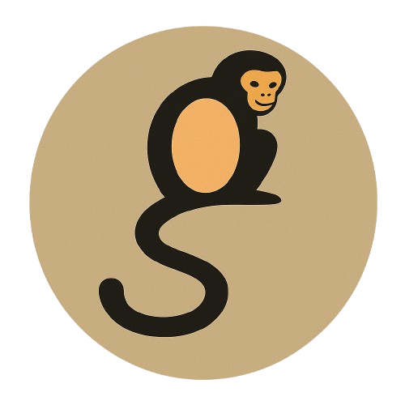
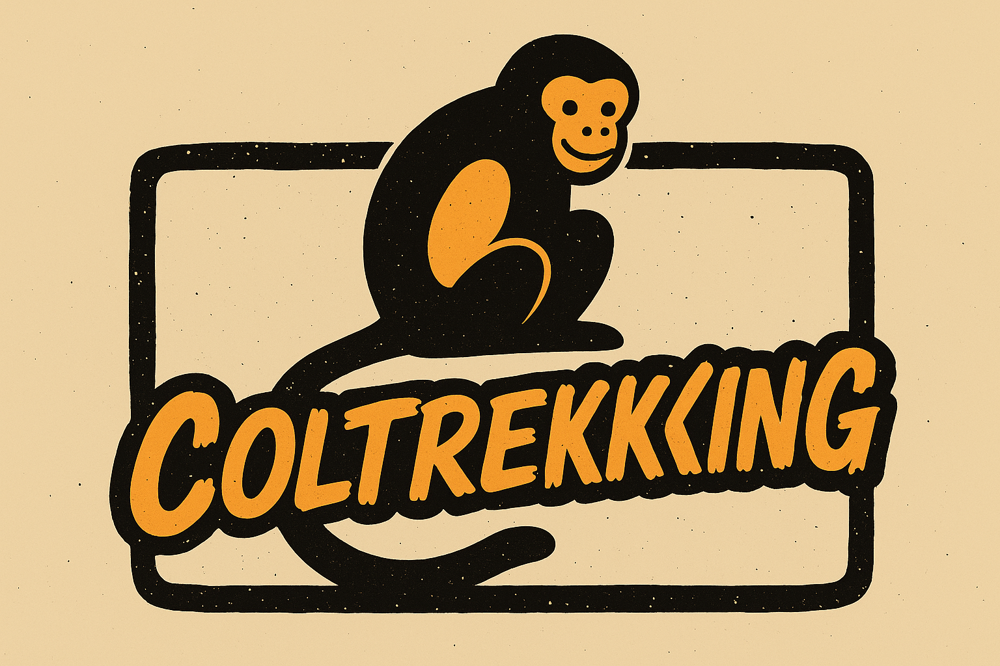
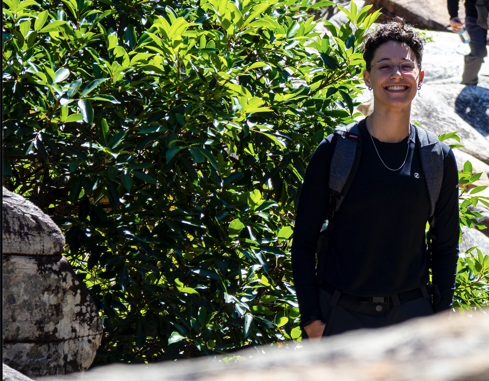

#  COLTREKKING WEB APP

---

### OBJETIVO CENTRAL

Desenvolver um aplicativo/site para inscrição nos eventos do Coltrekking!

O Coltrekking é um projeto de ensino que visa compreender melhor a realidade como ela se apresenta — e não como a idealizamos. O professor Humberto Honda é o principal viabilizador das atividades de trekking/hiking, por possuir vasto conhecimento das trilhas. Além disso, o projeto conta com uma comissão formada por alunos, que organizam as datas e os locais das trilhas, acompanham o professor no monitoramento do grupo durante os percursos e realizam as preleções para selecionar os participantes de cada atividade.

---

### PRINCIPAIS FUNCIONALIDADES

O site funciona como um **gestor de eventos**, permitindo que administradores publiquem trilhas com diversas especificações: distância, rota, tipo de trajeto, nível de dificuldade, data, entre outros. Os usuários — alunos, professores e servidores do COLTEC — poderão se inscrever para participar das trilhas.

Também está prevista a implementação das seguintes abas:

- **Lista Negra**: exibição de pessoas suspensas das trilhas por faltas não justificadas ou condutas inadequadas;
- **Fotos**: substituindo o antigo compartilhamento por WhatsApp, com acesso a um drive organizado;
- **Instruções Gerais**: com orientações sobre o que levar, o que evitar, precauções e recomendações importantes;
- **Eventos**: página principal para visualização e inscrição nas trilhas.

---

### COMO REALIZAR

O site será desenvolvido do zero, utilizando as novas tecnologias do Google, como **Firebase**, **Sheets**, **Cloud Functions**, **Realtime Database**, **Hosting**, entre outras, conforme a necessidade do projeto.

---

#### Sobre a desenvolvedora

Oi! Meu nome é **Júlia Souza**. Atualmente curso o ensino técnico integrado em Desenvolvimento de Sistemas no **Colégio Técnico da UFMG (COLTEC)**.

Conheci o projeto Coltrekking assim que entrei no colégio e me interessei. Participei de algumas trilhas entre 2023 e 2024 e, neste ano, passei a ir a todas que consigo! Me apaixonei pelas trilhas e, em 2025, fui aprovada no processo seletivo do **Programa de Monitoria do COLTEC** para desenvolver este site como estágio de conclusão de curso e complementador do Projeto de Ensino.

