

  # **COLTREKKING WEB APP** 

  
  

---

### OBJETIVO CENTRAL

Desenvolver um aplicativo/site para inscrição nos eventos do Coltrekking!

O Coltrekking é um projeto de ensino que visa compreender melhor a realidade como ela se apresenta — e não como a idealizamos. O professor Humberto Honda é o principal viabilizador das atividades de trekking/hiking, por possuir vasto conhecimento das trilhas. Além disso, o projeto conta com uma comissão formada por alunos, que organizam as datas e os locais das trilhas, acompanham o professor no monitoramento do grupo durante os percursos e realizam as preleções para selecionar os participantes de cada atividade.

---

### PRINCIPAIS FUNCIONALIDADES

O site funciona como um **gestor de eventos**, permitindo que administradores publiquem trilhas com diversas especificações: distância, rota, tipo de trajeto, nível de dificuldade, data, entre outros. Os usuários — alunos, professores e servidores do COLTEC — podem se inscrever para participar das trilhas com a conta institucional (@teiacoltec).

### Autenticação com Google
Permite ao usuário fazer login diretamente com o Google, com restrição obrigatória ao e-mail institucional **@teiacoltec**.

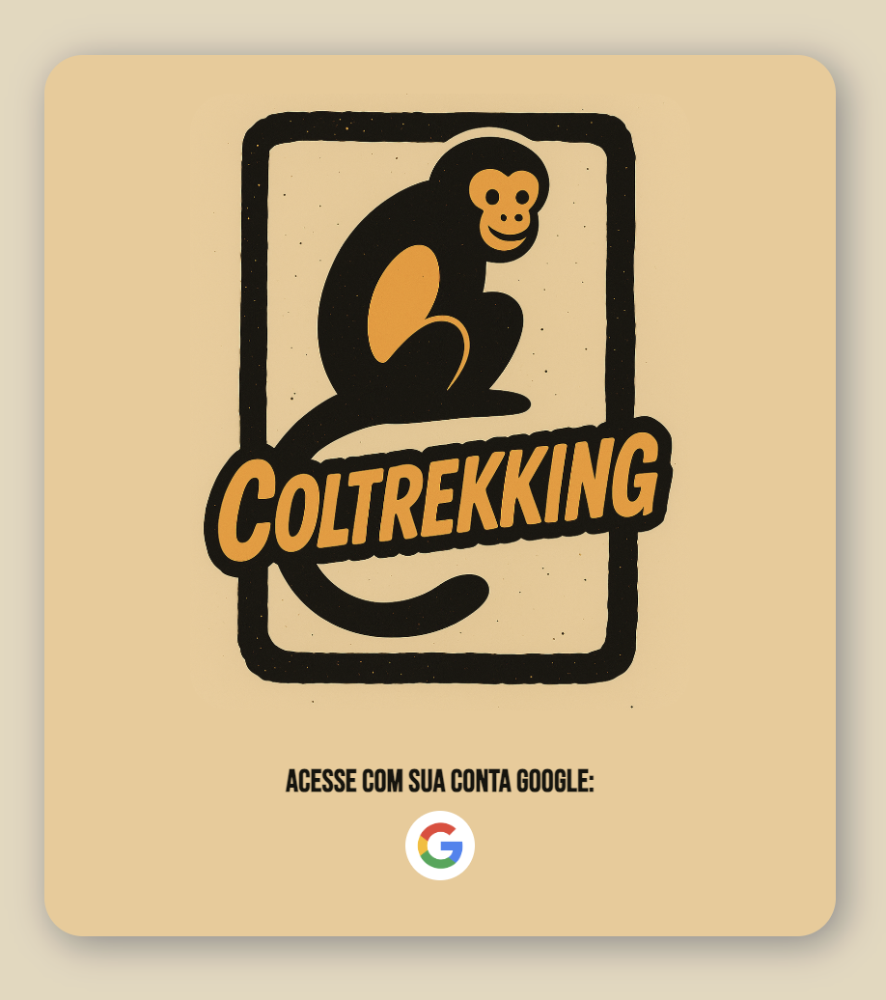

### Gestão e Edição de Eventos
Permite que os administradores criem ou editem eventos. O sistema valida regras de datas e exige o preenchimento de todos os campos para garantir a organização.

<table>
  <tr>
    <td width="50%">
      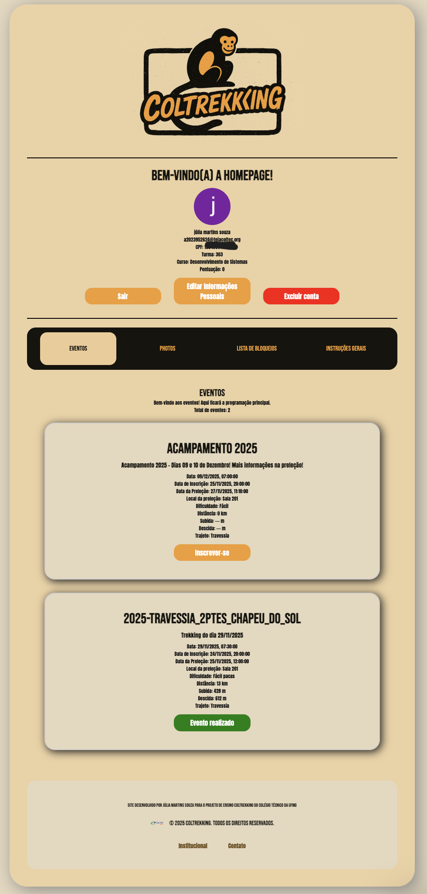  
      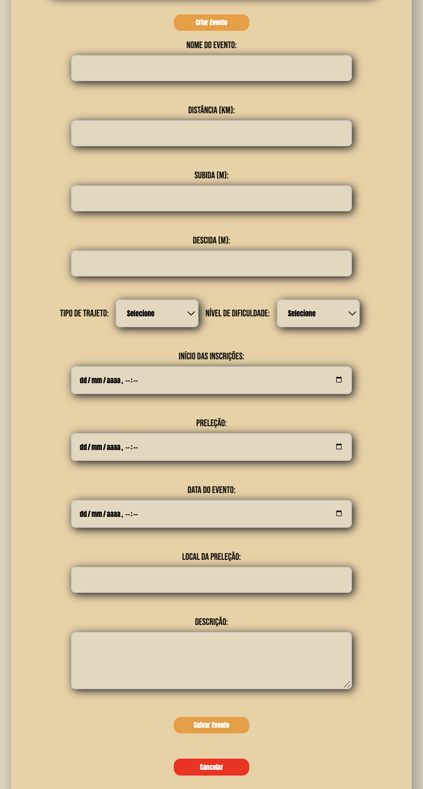
    </td>
    <td width="50%" valign="center">
      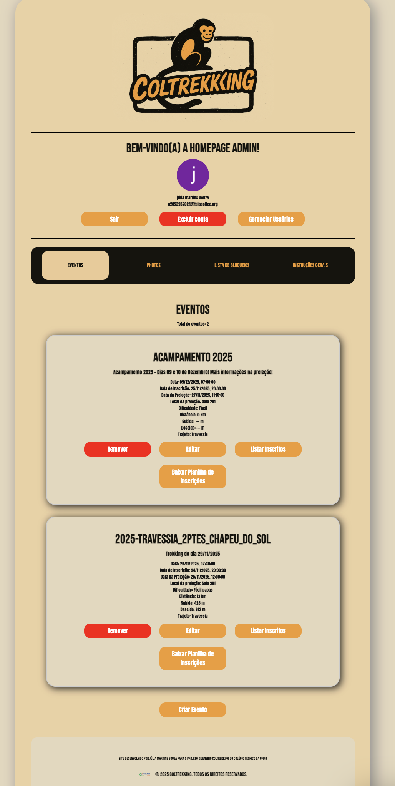  
      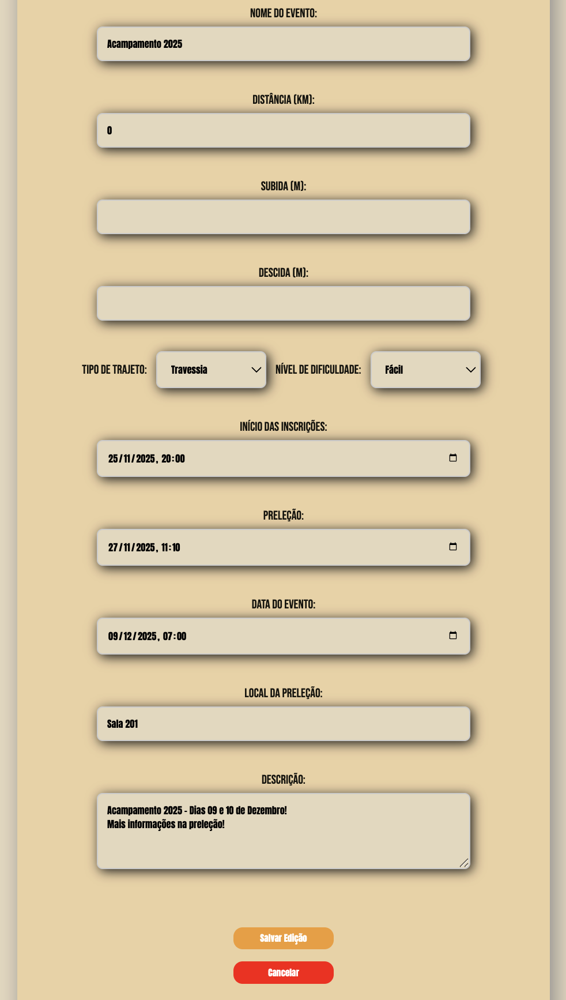
    </td>
  </tr>
</table>

### Aba Photos
Substituindo o antigo compartilhamento por WhatsApp, esta aba permite que administradores publiquem links de drives, mantendo as fotos organizadas e acessíveis.

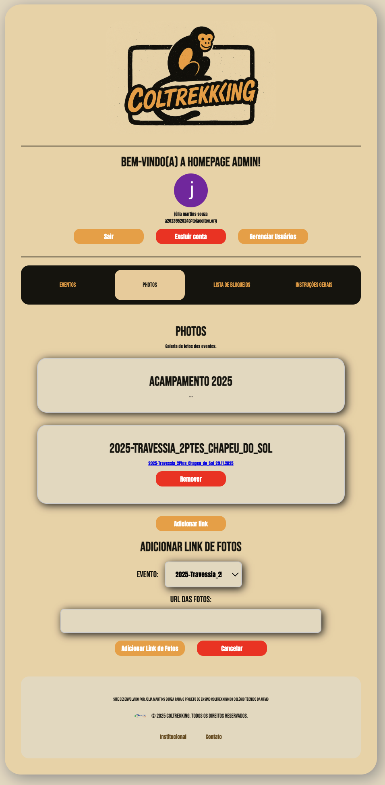 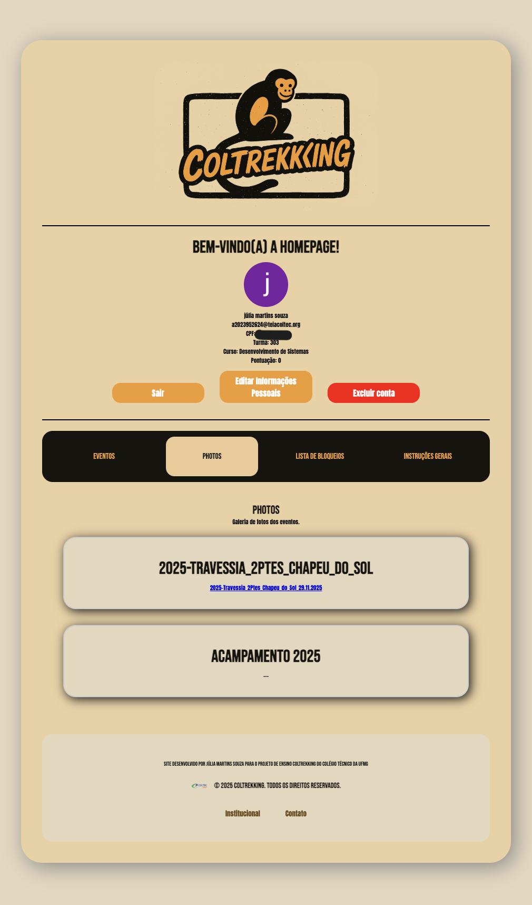

### Gerenciador de Usuários e Segurança
* **Promoção de Admins:** Facilita a transição de membros da comissão, permitindo promover novos administradores.
* **Lista de Bloqueios:** Exibição de pessoas suspensas por faltas não justificadas ou condutas inadequadas.
* **Instruções Gerais:** Orientações sobre o que levar, precauções e recomendações.

<table>
  <tr>
    <td width="50%">
      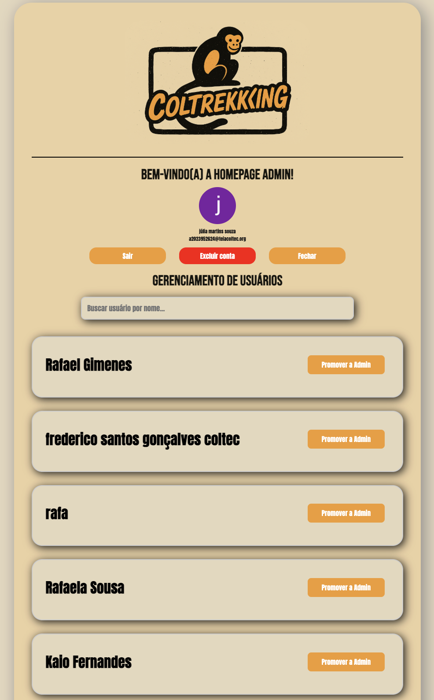  
      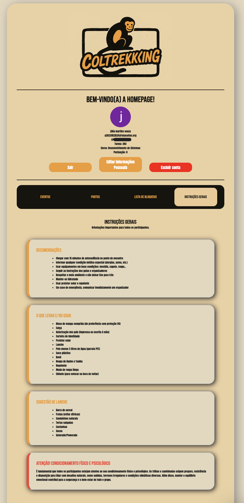
    </td>
    <td width="50%" valign="center">
      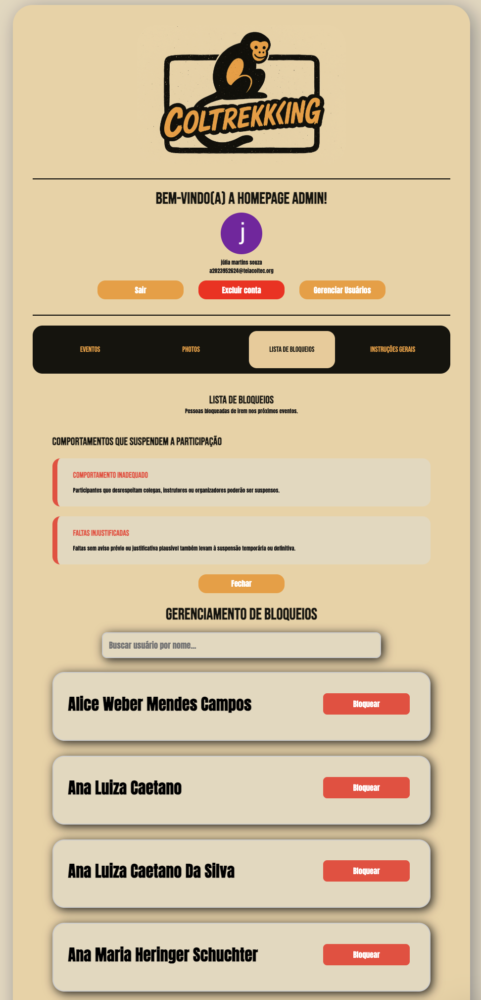  
      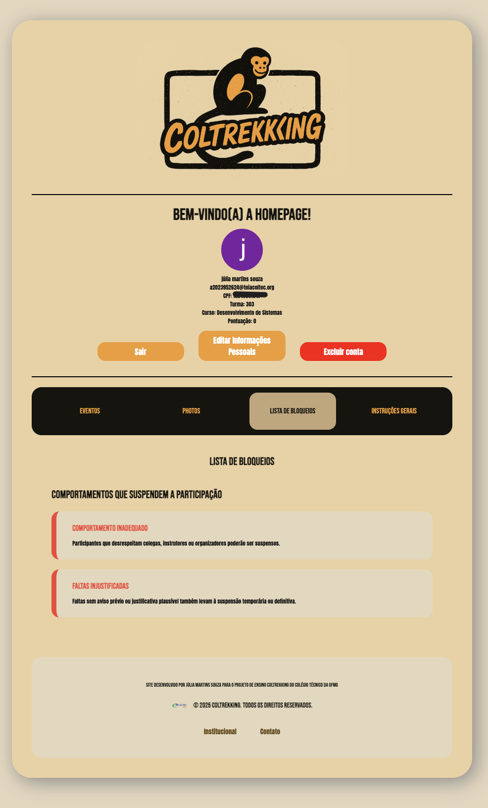
    </td>
  </tr>
</table>

### Administrativo e Inscrições
* **Dados e Planilhas:** Coleta de informações pessoais (com validação de CPF) e exportação de listas em **.csv**.
* **Controle de Presença:** Listagem de inscritos para confirmação de presença e cálculo do **Fator K**.
* **Inscrições:** Sistema de abertura automática em horários determinados e opção de cancelamento pelo usuário.

  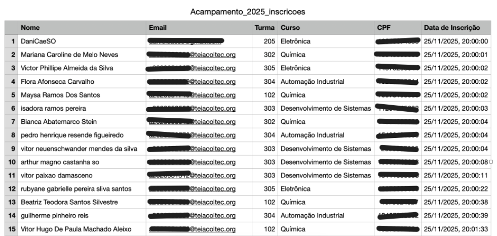
  
    

  <table border="0">
    <tr>
      <td align="center" valign="bottom">
        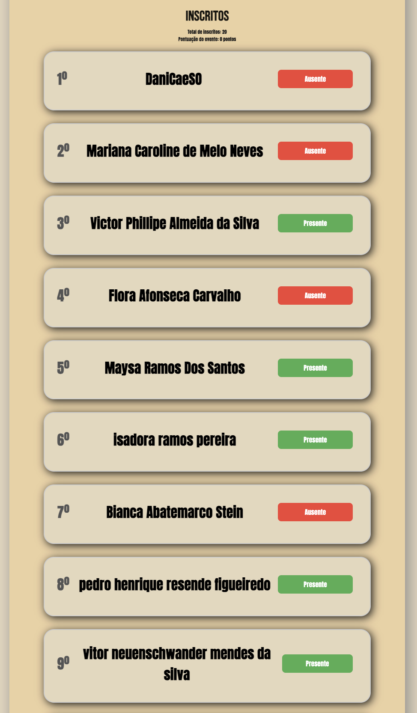
      </td>
      <td align="center" valign="bottom">
        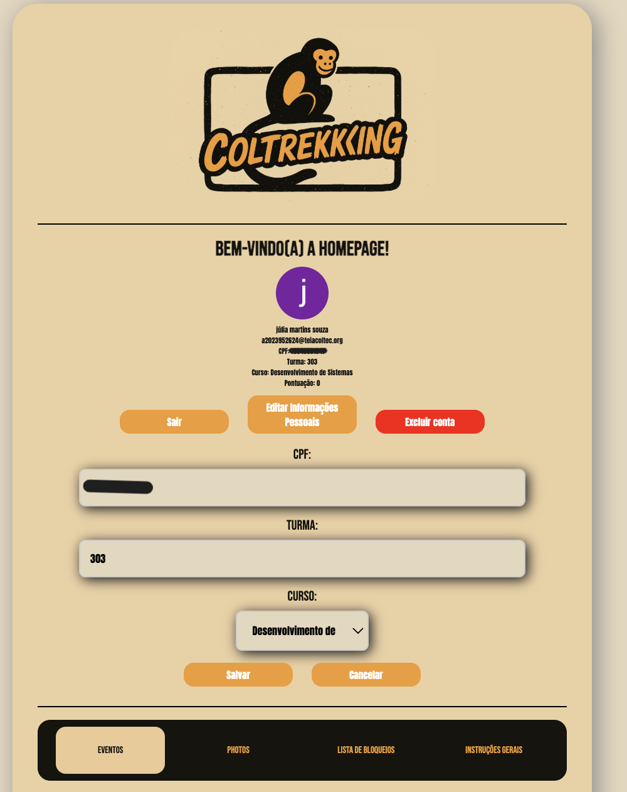
      </td>
    </tr>
  </table>

---

### COMO FOI REALIZADO

O site foi desenvolvido do zero, utilizando as tecnologias do Google, como **Firebase Authentication**, **Cloud Functions**, **Realtime Database** e **Hosting**. As linguagens utilizadas foram HTML, JavaScript, CSS e JSON.

---

### Sobre a desenvolvedora

Oi! Meu nome é Júlia, mais conhecida como Julinha.

Sou formada no curso técnico integrado em Desenvolvimento de Sistemas pelo Colégio Técnico da UFMG (COLTEC), e este projeto nasceu do meu estágio de conclusão de curso.

Minha história com o Coltrekking começou logo no primeiro ano de colégio. O que começou como uma curiosidade em 2023 se tornou uma paixão: no meu último ano, eu já não perdia uma trilha sequer! Essa conexão com o projeto me motivou a ser aprovada no Programa de Monitoria do COLTEC, onde tive a oportunidade de unir a tecnologia e a natureza. Desenvolver este sistema foi a forma que encontrei de retribuir ao projeto, transformando meu estágio em uma solução real para facilitar a organização das trilhas que tanto amo.

<table align="center">
  <tr>
    <td>
      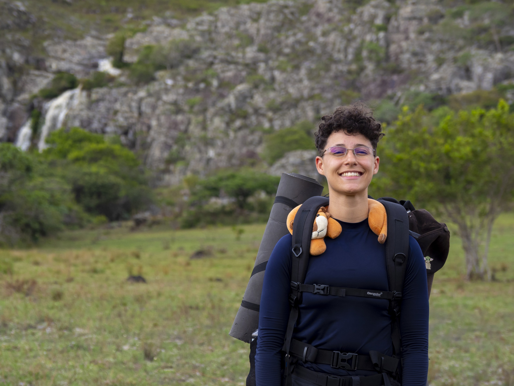 
      
    </td>
    <td valign="center">
      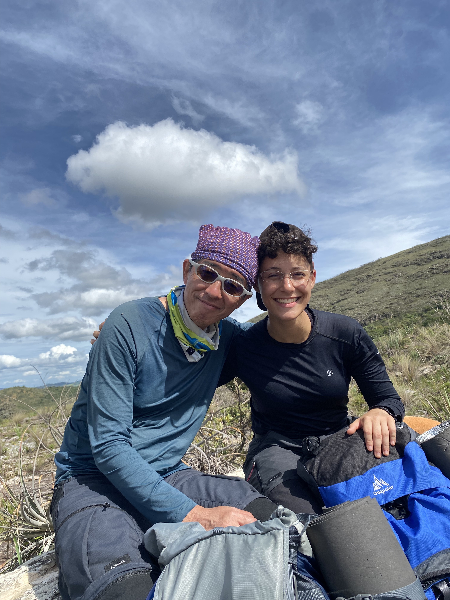
    </td>
  </tr>
</table>

### COLTEC 2025

